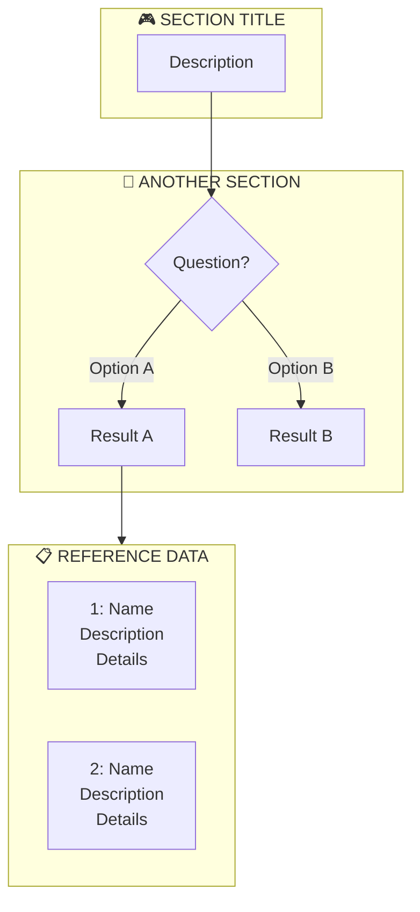

# Charts

Generate a mermaid flowchart from triggers.json. Output to `stuff/trigger-chart.html`.

## Design Principles

- **Organized sections**: Group related triggers into labeled subgraphs
- **Decision trees**: Use diamond nodes `{}` for branching logic
- **Detailed nodes**: Include descriptions, not just names
- **Visual hierarchy**: Flow from top to bottom, sidebars for reference data
- **Emoji labels**: Use icons to distinguish section types

## Mermaid Structure



## Node Types

- **Start nodes**: `["Label"]` - rectangles
- **Decision nodes**: `{"Question?"}` - diamonds
- **Multi-line content**: Use `<br/>` for line breaks
- **Connections**: `-->|"label"| ` for labeled edges

## Analyzing Triggers

1. Identify trigger categories (setup, gameplay, context, etc.)
2. Find decision points (conditions that branch)
3. Map cause → effect relationships
4. Group related triggers into subgraphs
5. Create sidebar for reference data (characters, locations, items)

## HTML Template

```html
<!DOCTYPE html>
<html>
<head>
  <meta charset="UTF-8">
  <title>Trigger Chart</title>
  <script src="https://cdn.jsdelivr.net/npm/mermaid/dist/mermaid.min.js"></script>
  <style>
    body { background: #1a1a1a; padding: 40px; font-family: system-ui; color: #e0e0e0; }
    h1 { color: #fff; text-align: center; margin-bottom: 40px; }
    .mermaid { background: #252525; padding: 40px; border-radius: 12px; }
  </style>
</head>
<body>
  <h1>Game Flow</h1>
  <pre class="mermaid">
flowchart TD
    %% Content here
  </pre>
  <script>
    mermaid.initialize({
      startOnLoad: true,
      theme: 'dark',
      flowchart: { curve: 'basis', padding: 20, nodeSpacing: 50, rankSpacing: 60 }
    });
  </script>
</body>
</html>
```

## Section Patterns

**Game start**:
```
subgraph START["🎮 GAME START"]
    BEGIN["Player Begins"]
end
```

**Branching logic**:
```
subgraph BRANCH["🔴 SECTION NAME"]
    QUESTION{"Condition?"}
    QUESTION -->|Yes| PATH_A["Result A"]
    QUESTION -->|No| PATH_B["Result B"]
end
```

**Reference sidebar**:
```
subgraph SIDEBAR["📋 REFERENCE"]
    ITEM1["1: Name<br/>Description<br/>Type: Value"]
    ITEM2["2: Name<br/>Description<br/>Type: Value"]
end
```

**Gameplay section**:
```
subgraph GAMEPLAY["🔴 DURING GAMEPLAY"]
    EVENT1["📋 EVENT NAME<br/>Description line 1<br/>Description line 2"]
    EVENT2["⚔️ ANOTHER EVENT<br/>More details"]
end
```

## Steps

1. Read triggers file (default: `tabs/triggers.json`)
2. Categorize triggers by purpose (setup, selection, gameplay, context)
3. Identify decision points and branching conditions
4. Extract reference data (characters, locations, items) for sidebars
5. Build flowchart with labeled subgraphs
6. Connect sections with meaningful flow
7. Write to `stuff/trigger-chart.html`
8. Open in browser
